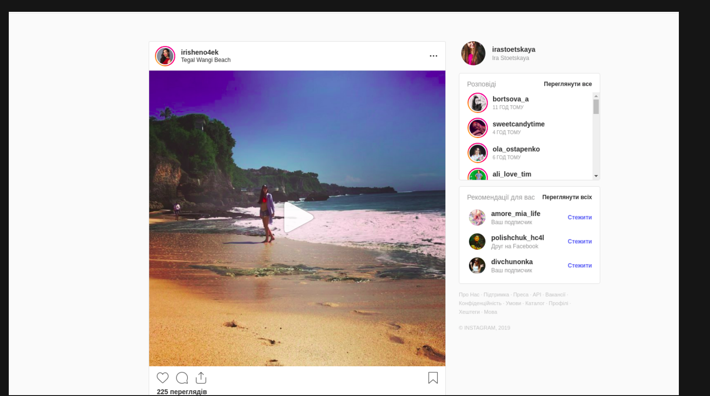

## Задание

Реализовать веб-приложение, аналог [Instagram](https://www.instagram.com/).

#### Командная работа

На данном проекте все студенты разделены на группы по три человека. Участники команды могут самостоятельно решить, как распределить задачи по проекту. Срок выполнения проекта - 2 недели.

#### Технические требования

Приложение должно содержать следующие страницы и функционал:

**1. Главная страница**
   
   Составляющие страницы:
   - Лента из постов (левая часть скриншота ниже). Каждый пост содержит в себе - фотографию, кнопку лайка, поле для добавления комментария, и комментарии, если они к посту есть. Комментарий должен показываться только последний. Если комментариев больше чем 1  - должна появляться кнопка `Показать больше`, по клику на которую - показываются все комментарии. По двойному клику на фотографию - пост лайкается. Когда пост лайкается - иконка лайка должна окраситься в другой цвет. Первые три поста загружаются сразу, остальные посты должны подгружаться с помощью технологии Infinity scroll. Для реализации можно использовать любую библиотеку, или реализовать самостоятельно.
   - Список людей, на которых человек подписан (правая верхняя часть скриншота). Каждый "человек" - это иконка и никнейм. Это должна быть кликабельная ссылка, при клике на которую вы должны попасть на страницу постов этого человека.
   - Список людей, на которых можно подписаться (правая нижняя часть скриншота). Каждый "человек" - это иконка, никнейм, и кнопка `Подписаться`. Иконка и никнейм -  кликабельная ссылка, при клике на которую вы должны попасть на страницу постов этого человека. По нажатию на кнопку `Подписаться` - система подписывает вас на обновления этого человека. Название кнопки меняется на `Отписаться`. В этот список не должны попасть люди, на которых человек уже подписан. При перезагрузке страницы те люди, на которых вы подписались во втором списке, должны быть показаны уже в первом списке.

   Пример - 

**2. Страница постов конкретного человека**
   
   Составляющие страницы:
   - Никнейм человека + кнопка `Подписаться`. Если пользователь уже подписан на эту страницу, вместо кнопки `Подписаться` должна быть кнопка `Отписаться`.
   - Посты человека в хронологическом порядке в виде сетки. Каждый пост представляет из себя фотографию. По наведению на фотографию - она затемняется, сверху показывается количество лайков и комментариев с соответствующими иконками. 
   - По клику на одну из фотографий - появляется модальное окно, которое содержит в себе фотографию и комментарии к посту. При клике на затемненную область снаружи модального окна, оно должно закрываться.

   Пример:
   
   
   

Дизайн приложения может быть любой. За основу можно взять стили настоящего Instagram. Также можно придумать свой дизайн и реализовать его. Главное, чтобы были выполнены все условия по наполнению страницы контентом, прописанные в требованиях выше.

Для стилизации можно использовать любую библиотеку (Bootstrap, Bulma, MaterialUI и т.д), или писать все стили самостоятельно.

В проекте должен использоваться SCSS (кроме случая использования MaterialUI и/или JSS).

Также, приложение нужно обязательно разместить в интернете. Деплой может быть, как на Heroku, так и на Amazon, на усмотрение команды.

Данные, которые выводятся на страницу - должны быть статическими. Для этого, команде нужно создать несколько коллекций в MongoDb, с помощью Node.js получить нужные данные, и вывести их на страницы. Структура коллекций - на усмотрение команды.

Обязательно необходимо покрыть фронт-енд часть приложения юнит-тестами.

В работе можно использовать любые npm-модули на усмотрение команды.

Также необходимо создать файл [README.MD](https://dan-it.gitlab.io/fe-book/teamwork/readme.html) в корне проекта с описанием проекта, списком участников и инструкцией по запуску проекта.

#### Необязательное задание продвинутой сложности:

- Добавить возможность создавать собственные посты. При добавлении поста - обязательной является загрузка фотографии.
- Реализовать пользовательскую авторизацию и возможность работы приложения с несколькими пользователями.
- Написать юнит-тесты для бэк-энда